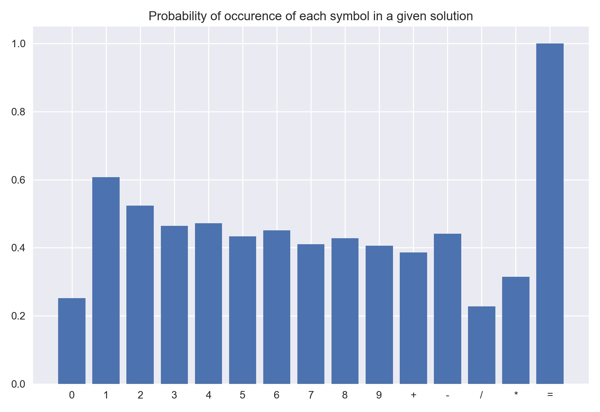
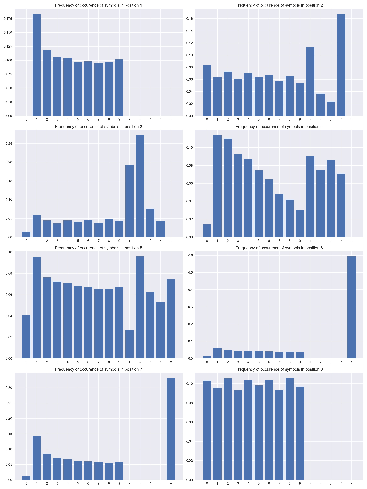

## Nerdle Analysis

https://nerdlegame.com/

This repository contains some analysis of possible nerdle answers. Here's a quick overview:
- [`nerdle.py`](nerdle.py) contains code to generate all possible nerdle answers.
- [`all_answers.txt`](all_answers.txt) contains those generated answers.
- [`analysis.ipynb`](analysis.ipynb) contains analysis of those generated answers, including various frequency plots, and information on the likelyhood of different operator combinations and number lengths appearing.
- [`plots/*`](plots/) are plots from the notebook.

### Probability of a given symbol appearing

### Frequency of symbols per position

### Most common answer formats
The `x`s represent digits, and the percentage is the percentage of all possible answers in that format.
 1) `xx+xx=xx`: 18.28%
 2) `xx-xx=xx`: 18.28%
 3) `xx-x*x=x`:  4.01%
 4) `xx-x-x=x`:  3.89%
 5) `xx/x-x=x`:  3.83%
 6) `x*x+x=xx`:  3.68%
 7) `x+x*x=xx`:  3.68%
 8) `x+x+x=xx`:  3.64%
 9) `xxx/xx=x`:  3.46%
10) `xxx/x=xx`:  3.46%

Take a look at [`analysis.ipynb`](analysis.ipynb) for more!
